# Apliclação - Arena Pokemon.

### Projeto
- Essa aplicação é composta por um backend em NodeJs+TypeScript e um frontend em ReactJS+TypeScript. Tem por objetivo colocar em prática os conteudos aprendidos na disciplina Fundamento de Banco de Dados.
A aplicação consiste em um CRUD de pokemon, ou seja você consegue criar um treinador, capturar um pokemon e relacionar com um único treinador, visualizar os pokemons capturados pelo treinador, modificar ou excluir um pokemon, logar com treinador já cadastrado, cadastrar uma imagem de perfil para o treinador. Essa aplicação tem como SGBD o postgreSql. O query builder [knex.js](http://knexjs.org/#Installation) que permite usar linguagem javascript nas consultas SQL. Um exemplo de consulta usando knex.js.

    SELECT em um banco qualquer.
    ```JS
        const response = await knex('tabela').select('*')
    ```

    EM sql 
    ```SQL
        SELECT * FROM tabela
    ```
    Criação de tabela no knex
    ```JS
        import Knex from 'knex';

        export async function up(knex: Knex) {
            return knex.schema.createTable('pokemon', table => {
                table.integer('id_pokemon').primary().notNullable();
                table.string('name').notNullable();
                table.string('image').notNullable();
                table.string('description').notNullable();
            });
        }

        export async function down(knex: Knex) {
            return knex.schema.dropTable('pokemon');
        }
    ```

### Techs (Backend)
- NodeJs
- KnexJs
- TypeScript
- CORS
- AXIOS
- SGBD: PostgreSql

### Modelagem do banco
Veja a modelagem [aqui](https://raw.githubusercontent.com/joaovictor3g/game-pokearena/master/assets/modelagem.svg)

### Como rodar?
- Clone este repositório: `git clone https://github.com/joaovictor3g/pokearena`
- cd pokearena
- Criar database Pokemon, em qualquer ferramenta de gerenciamento para postgresql (PgAdmin4, Postico...).
- rode `yarn` para instalar todas as dependências, caso não tenha yarn, pode usar `npm install` para instalá-las.
- cd server && run `yarn knex:migrate` ou `npm run knex:migrate` para rodar as migrations.
- Rode `yarn knex:rollback` caso queira excluir todas as tabelas do banco.
- Criar esta trigger, para que ao um treinador capturar um pokemon, seja registrado numa tabela chamada changelog:
    ```SQL
    CREATE OR REPLACE FUNCTION add_modifications()
    RETURNS TRIGGER AS $$ 
    	BEGIN 
    	  IF(TG_OP='INSERT') THEN
    	    INSERT INTO changelog(description) 
                VALUES('Treinador com id: ' || NEW.id_trainer 
                || ' capturou pokemon com id: '|| NEW.id_pokemon);
                RETURN NEW;
    	 END IF;
           END; 
    $$ LANGUAGE plpgsql;


    CREATE TRIGGER modifications
    	AFTER INSERT ON pokemon_trainer
    	FOR EACH ROW
    	EXECUTE PROCEDURE add_modifications();
    ```

- Após a criação desta trigger rodar `yarn knex:seed` ou `npm run knex:seed`, para que os registros na tabela chanfelog sejam feitos e um treinador e pokemon sejam criados.


- Após isto no mesmo diretório rode `yarn dev` ou `npm run dev`, para executar o backend da aplicação em modo de desenvolvimento. Com isso sua aplicação estará rodando no seguinte endereço: `http://localhost:3333`. Caso seja necessário testar as rotas do backend pode ser usado um software chamado Imsomnia.

### Rotas (backend)

- Rota que mostra os logs de captura de pokemon. `http://localhost:3333/changelog`


    [](https://insomnia.rest/run/?label=See%20Changelog&uri=http%3A%2F%2Flocalhost%3A3333%2Fchangelog)

- Resultado (exemplo):
    ```JSON
    [
      {
        "id": 1,
        "description": "Treinador com id: 1 capturou pokemon com id: 1"
      }
    ]
    ```

- Rota de visualizar todos os pokemons de um unico treinador, no caso treinador com id=1: `http://localhost:3333/see-your-pokemons/1`

- Resultado(exemplo):
    ```JSON
    [
      {
        "nickname": "bulbasaur",
        "id_pokemon": 1,
        "name": "bulbasaur",
        "image": "https://raw.githubusercontent.com/PokeAPI/sprites/master/sprites/pokemon/1.png",
        "description": "pokemon in grass"
      }
    ]
    ```
- Claro que estas informações estão salvas no banco de dados, o que está sendo executado por trás é:
    ```SQL
    SELECT pok.* FROM pokemon pok INNER JOIN pokemon_trainer ptr ON ptr.id_pokemon=pok.id_pokemon 
    INNER JOIN trainer tr ON  ptr.id_trainer=1
    ```

- Visualizando no PgAdmin como tabela:

    

- Caso deseje testar a rota.

    [](https://insomnia.rest/run/?label=Get%20All%20Pokemons%20From%20a%20Trainer&uri=http%3A%2F%2Flocalhost%3A3333%2Fsee-your-pokemons%2F1)

### Techs(FrontEnd)
- AXIOS
- react-dropzone
- react-router-dom
- TypeScript
- react-icons

### Como rodar?
- Com este repositório clonado e dentro do diretório do mesmo, vá até cd web.
- Rode `yarn` ou `npm install` para instalar todas as dependências. 
- Rode `yarn start` ou `npm start` para iniciar a aplicação.
- Com isso a aplicação estará rodando no endereço `http://localhost:3000`.
- Tenha certeza que o backend foi iniciado, para que todas as funcionalidades, sejam habilitadas.

### Layout

- __Pagina 1__: Login
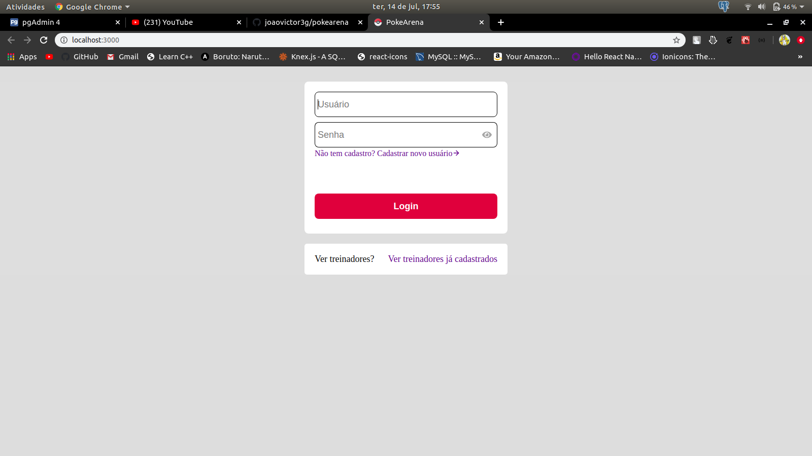
- Como não há nenhum treinador cadastrado na base de dados é necessário criar um treinador.

- __Página 2__: Criar treinador
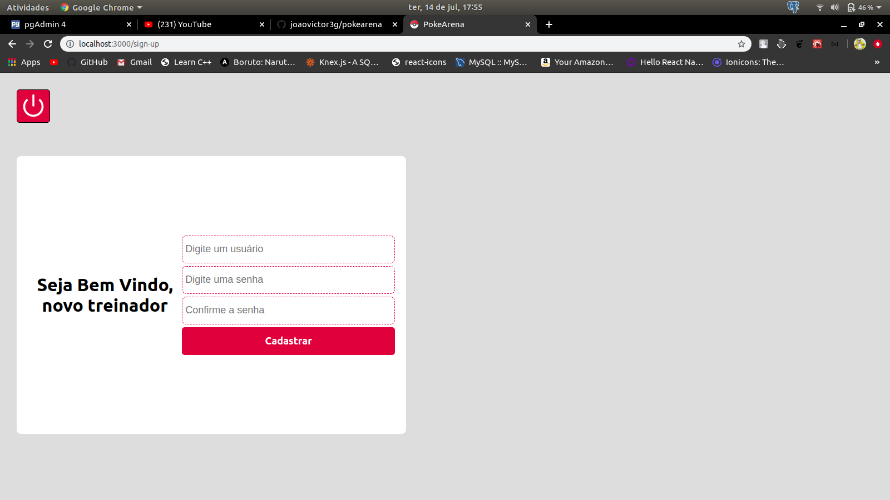
- Nessa tela é necessário preencher os três inputs. No caso eu preenchi da forma.
    ```JSON
        {
            "name": "Ash",
            "password": "1234"
        }
    ```
- Com isso esse usuário é cadastrado na base de dados.


- Voltando a pagina de login e preenchendo com estes dados.
- __Pagina 3__: Treinador Logado.

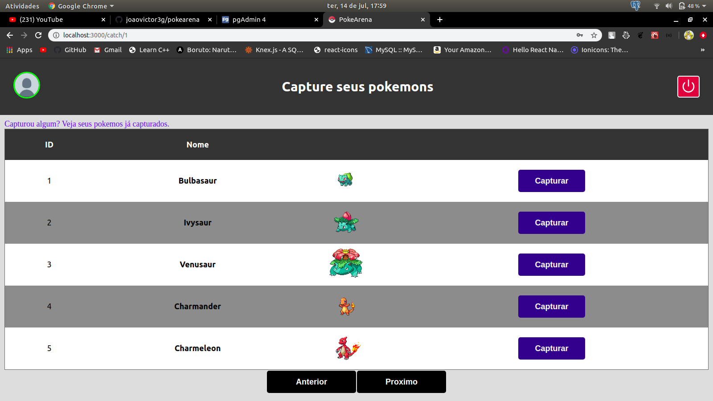

- Nessa tela é possível capturar pokemons e relacioná-los a um único treinador.

- Modal pagina 3: Confirmação de captura:

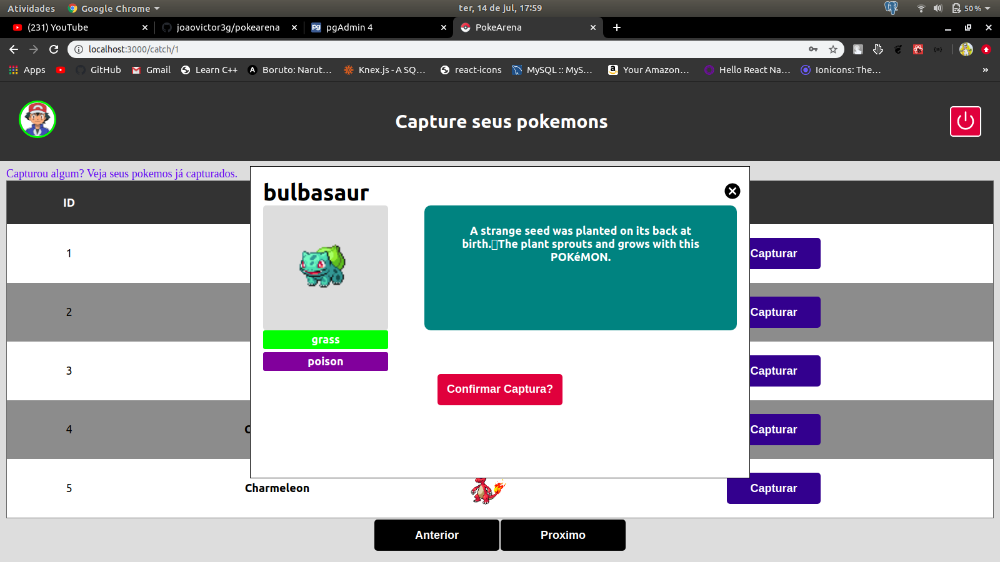

- Ao clicar no botão confirmar captura este pokemon é salvo na base de dados, numa tabela que relaciona o treinador e pokemon: pokemon_trainer, que recebe o id do pokemon e o id do treinador.

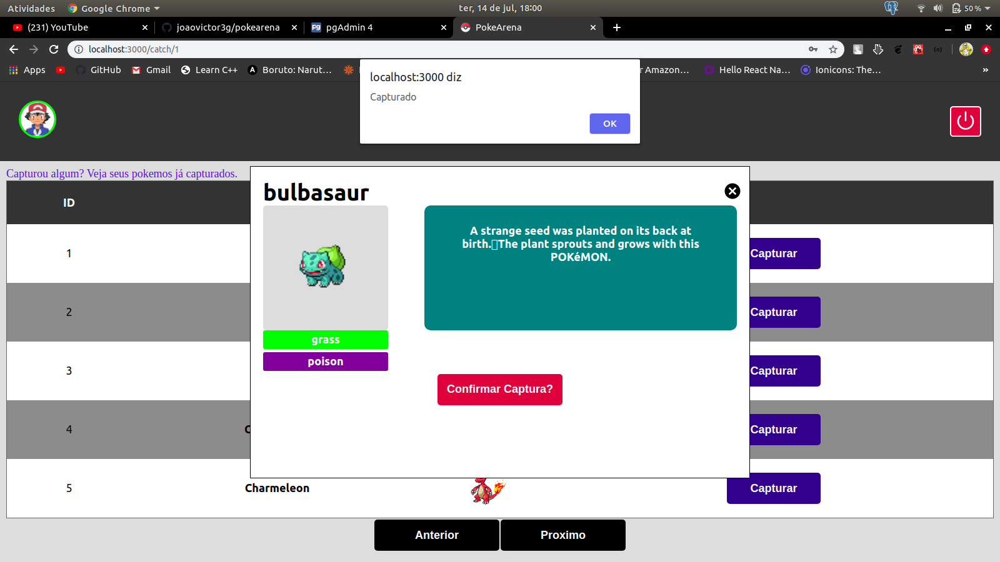

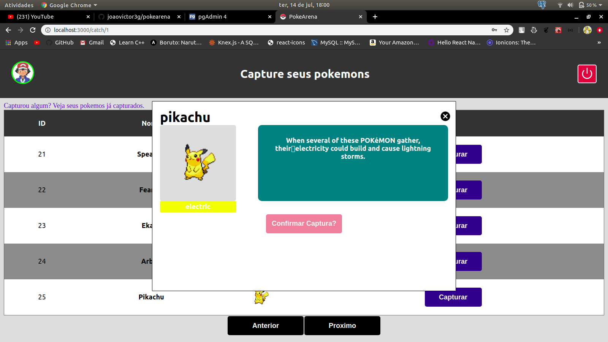

- __Página 4:__ Visualizar pokemons capturados: Aqui é feita uma busca no banco, que retorna todos os pokemons que o usuário com id=1 tem.
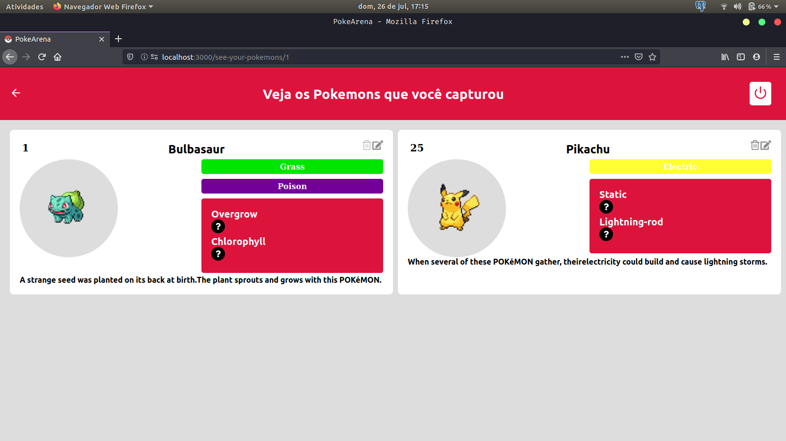

    - Ainda nessa página é possível excluir um pokemon de um treinador e alterar o nome, só para este treinador.


- __Página 5:__ Alterar avatar do treinador: é possível alterar a imagem do treinador, por upload de imagens:
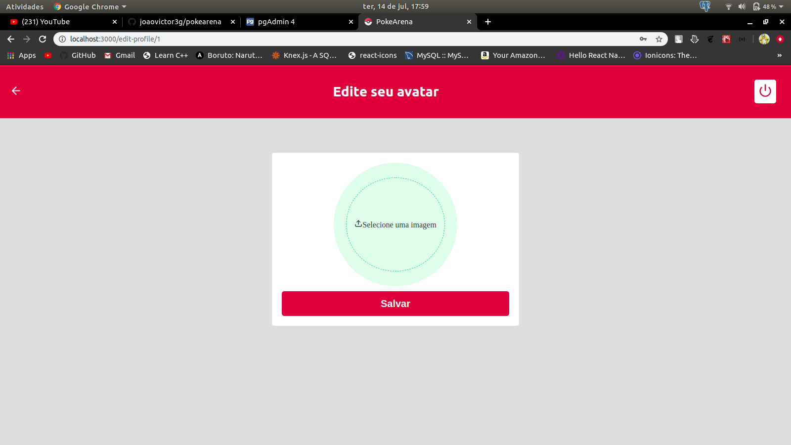
    - Aqui se recebe uma imagem e esta é guardada no backend, só nome do arquivo é salvo no banco.
    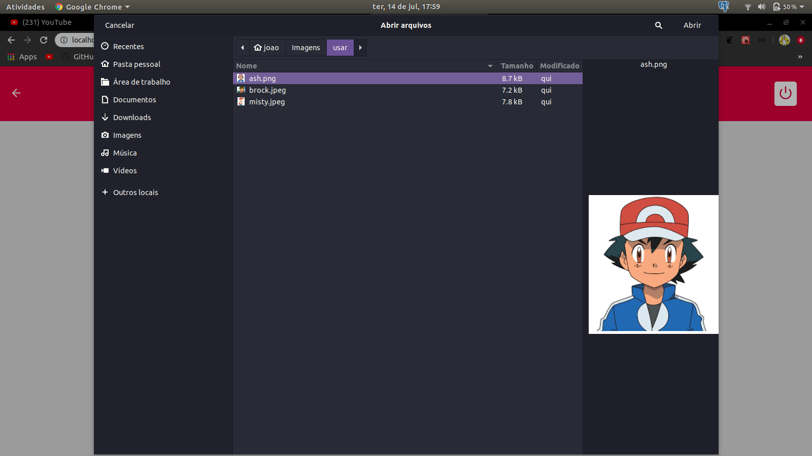
    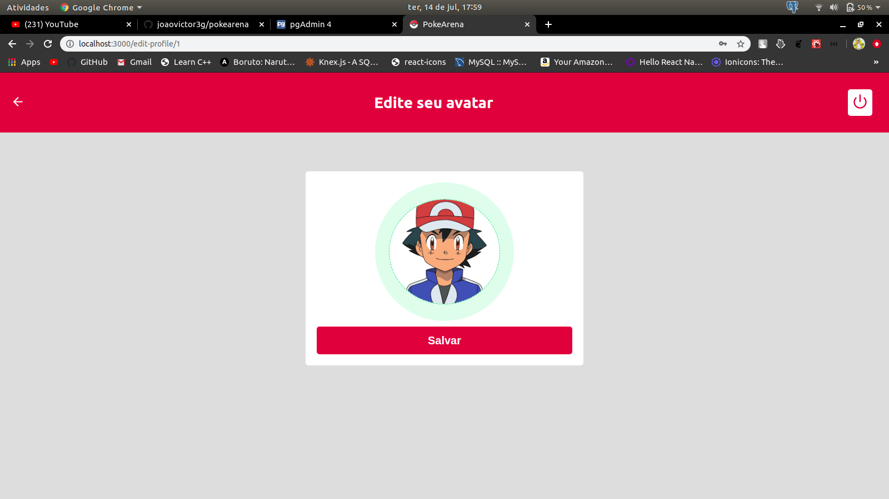
    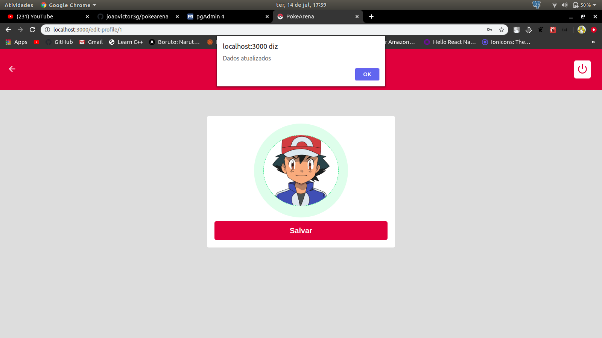
    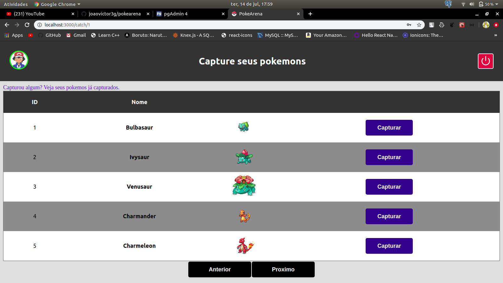